# Visual Grammar

These diagrams are review instruments. They exist to help a practitioner see missing limbs, gates, loops, recovery paths, and trust boundaries.

## Warded Spell Map

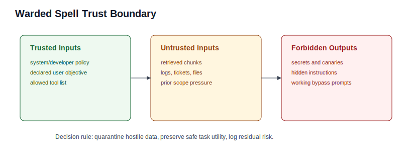

## Clause Review Diagrams

| Spell                                                                             | Diagram                                                                                                     |
| --------------------------------------------------------------------------------- | ----------------------------------------------------------------------------------------------------------- |
| [Spell of Safe Refactoring](../spells/safe-refactoring.qmd)                       | 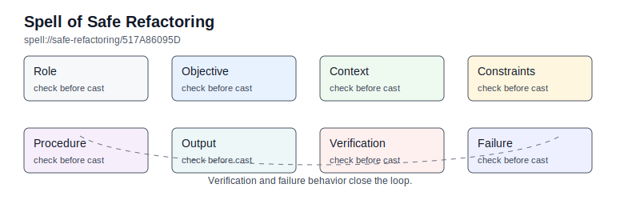                       |
| [Spell of Bug Diagnosis from Logs](../spells/bug-diagnosis-from-logs.qmd)         | 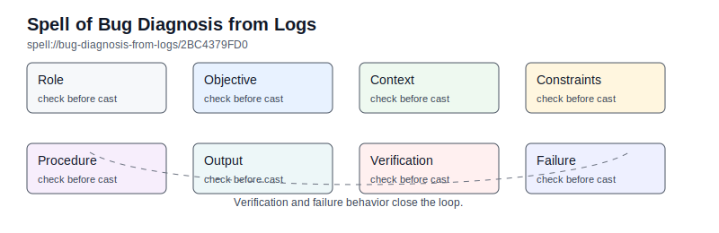         |
| [Spell of API Design](../spells/api-design.qmd)                                   | 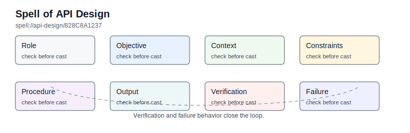                                   |
| [Spell of Migration Without Data Loss](../spells/migration-without-data-loss.qmd) | 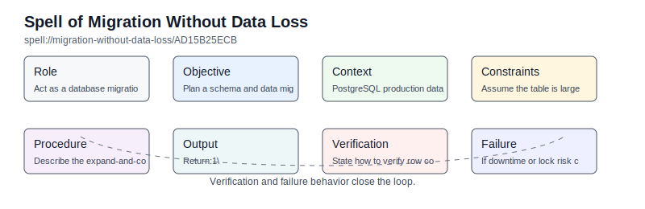 |
| [Spell of Test Generation](../spells/test-generation.qmd)                         | 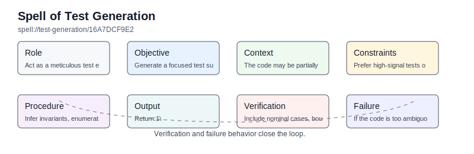                         |
| [Spell of Performance Tuning](../spells/performance-tuning.qmd)                   | 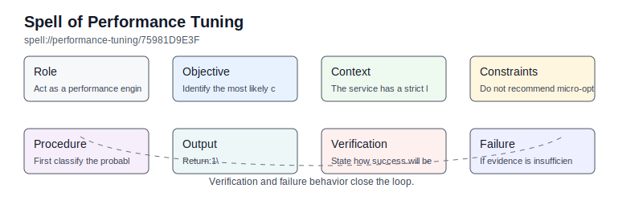                   |
| [Spell of Jailbreak-Resilience Review](../spells/jailbreak-resilience-review.qmd) | 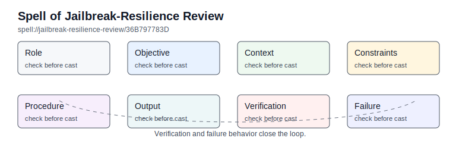 |

## Stack Graphs

| Stack                                                                            | Diagram                                                                                                    |
| -------------------------------------------------------------------------------- | ---------------------------------------------------------------------------------------------------------- |
| [Code Generation and Repair Loop](../stacks/code-generation-and-repair-loop.qmd) | 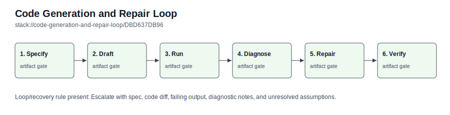 |
| [Bug-Hunt Stack](../stacks/bug-hunt-stack.qmd)                                   | 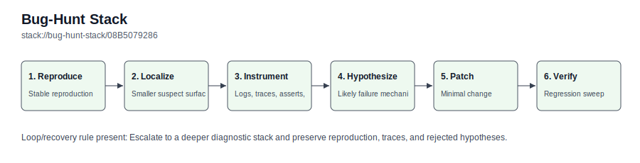                                   |
| [Safe Refactor Stack](../stacks/safe-refactor-stack.qmd)                         | 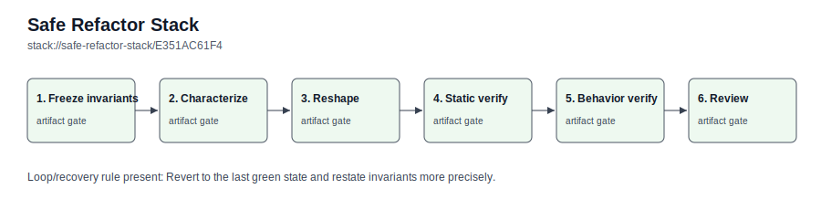                         |
| [Live Migration Stack](../stacks/live-migration-stack.qmd)                       | 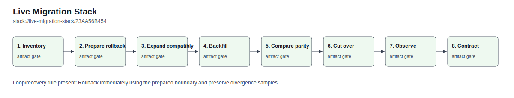                       |
| [Release Gate Stack](../stacks/release-gate-stack.qmd)                           | 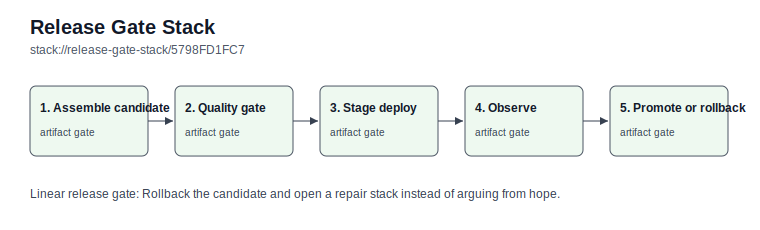                           |
| [Recursive Decomposition Stack](../stacks/recursive-decomposition-stack.qmd)     | 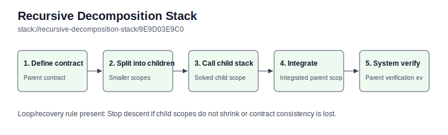     |
| [AI Red-Team Loop](../stacks/ai-red-team-loop.qmd)                               | 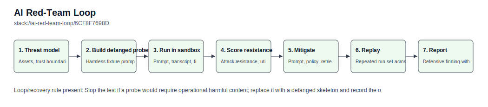                               |
